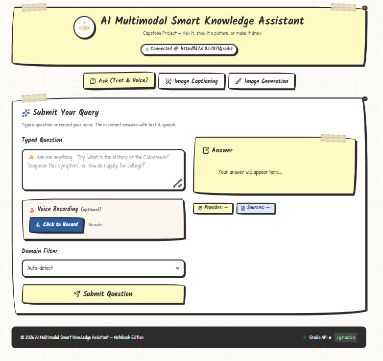
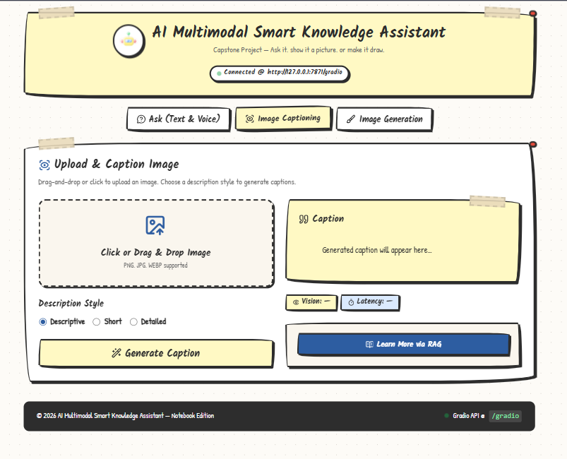
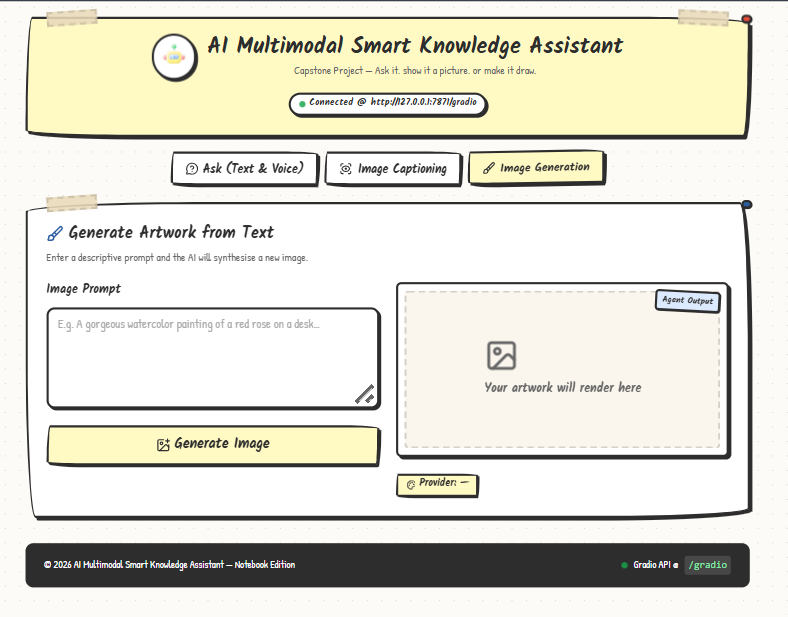

<div align="center">
  
  <h1>AI Multimodal Smart Knowledge Assistant</h1>
  <p>An enterprise-grade multimodal knowledge platform with voice interaction, computer vision, RAG retrieval, and AI image synthesis.</p>
  <p>
    
    
    
    
    
    
  </p>
</div>

---

<table>
  <tr>
    <td align="center" width="33%">
      
      <br>
      <b>Ask — Text &amp; Voice Query</b>
      <br>
      <sub>Type or record your question. The assistant answers with text and speech audio.</sub>
    </td>
    <td align="center" width="33%">
      
      <br>
      <b>Image Captioning</b>
      <br>
      <sub>Upload any image and generate AI captions. Follow up with a RAG knowledge query.</sub>
    </td>
    <td align="center" width="33%">
      
      <br>
      <b>AI Image Generation</b>
      <br>
      <sub>Enter a text prompt to synthesise original digital artwork.</sub>
    </td>
  </tr>
</table>

</div>

---

## Table of Contents

- [Overview](#overview)
- [Key Features](#key-features)
- [System Architecture](#system-architecture)
- [Project Structure](#project-structure)
- [Installation](#installation)
- [Configuration](#configuration)
- [Running the Application](#running-the-application)
- [API Reference](#api-reference)
- [Testing](#testing)
- [Troubleshooting](#troubleshooting)
- [License](#license)

---

## Overview

The **AI Multimodal Smart Knowledge Assistant** integrates local domain intelligence with multi-provider cloud AI. It resolves complex queries across seven pre-indexed knowledge domains — College, Tourism, Healthcare, Agriculture, Library, Museums, and Historical Monuments — while handling both voice and text inputs.

When local vector similarity scores fall below confidence thresholds, the system automatically initiates a **Live Web Search Fallback** via DuckDuckGo, ensuring accurate answers to real-time and current queries.

---

## Key Features

### Voice and Text Q&A

Accepts typed questions or live microphone recordings. Speech is transcribed locally using OpenAI Whisper (`small` model) via FFmpeg, with zero dependency on cloud STT APIs. Answers are synthesised into spoken audio using gTTS.

### Dual-Layer Retrieval (RAG + Web)

Domain documents are chunked and indexed into a persistent ChromaDB vector store using SentenceTransformer embeddings (`all-MiniLM-L6-v2`). When vector similarity is insufficient, the engine falls back to live DuckDuckGo search with automatic snippet extraction.

### Multi-Provider LLM Router

Requests route to **Google Gemini** (`gemini-flash-latest`) as the primary provider, with automatic failover to **Groq** (`llama-3.3-70b-versatile`) on rate limit or timeout errors. Fully transparent to the user.

### Image Captioning

Upload any image (JPEG, PNG, WEBP) and receive AI-generated descriptions in three style modes: Descriptive, Short, or Detailed. Generated captions can seed follow-up RAG queries.

### Text-to-Image Synthesis

Enter any descriptive prompt and synthesise original digital artwork via the Pollinations.ai engine, with optional Gemini prompt optimization for richer output quality.

### Single-Process Architecture

One FastAPI + Uvicorn process on port `7871` serves both the full frontend UI and all REST and Gradio API endpoints.

---

## System Architecture

```
+------------------------------------------------------------------+
|                        USER INPUT LAYER                          |
|  +------------------------+     +-----------------------------+  |
|  |  Typed Text Question   |     |  Audio Recording (.wav)     |  |
|  +----------+-------------+     +-------------+---------------+  |
+-------------|------------------------------- -|------------------+
              |                               |
              |                               v
              |                  +------------------------+
              |                  |  OpenAI Whisper STT    |
              |                  |  (Local — small model) |
              |                  +----------+-------------+
              |                             |
              v                             v
+------------------------------------------------------------------+
|                     RAG & RETRIEVAL LAYER                        |
|             +------------------------------+                     |
|             |  ChromaDB Vector Store       |                     |
|             |  (SentenceTransformer Embed) |                     |
|             +---------------+--------------+                     |
|                             |                                    |
|           +-----------------+------------------+                 |
|       High Score                           Low Score             |
|           |                                    |                 |
|           v                                    v                 |
|  +------------------+          +---------------------------+    |
|  |  Knowledge Base  |          |  DuckDuckGo Live Web      |    |
|  |  (Local Docs)    |          |  Search Fallback           |    |
|  +---------+--------+          +-----------+---------------+    |
+------------|------------------------------|---------------------+
             |                              |
             v                              v
+------------------------------------------------------------------+
|                      LLM ROUTER & FALLBACK                       |
|         +------------------------------------------+            |
|         |  Primary:   Google Gemini Flash           |            |
|         +--------------------+---------------------+            |
|                       (on 429 / timeout)                         |
|                              v                                   |
|         +------------------------------------------+            |
|         |  Fallback:  Groq Llama 3.3 70B            |            |
|         +--------------------+---------------------+            |
+------------------------------------------------------------------+
                              |
                              v
+------------------------------------------------------------------+
|                       OUTPUT GENERATION                          |
|  +-----------------------------+  +---------------------------+  |
|  |  Formatted Markdown Text    |  |  gTTS Audio MP3 File      |  |
|  +-----------------------------+  +---------------------------+  |
+------------------------------------------------------------------+
```

---


## Project Structure

```
multimodal-knowledge-assistant/
├── config/
│   ├── __init__.py
│   └── settings.py              # Pydantic BaseSettings config loader
├── core/
│   ├── assistant.py             # MultimodalAssistant orchestrator
│   ├── llm_provider.py          # Provider router (Gemini to Groq)
│   ├── logger.py                # Loguru log config
│   └── schemas.py               # Pydantic schemas
├── data/
│   └── knowledge_base/          # Source documents across 7 domains
│       ├── agriculture/
│       ├── college/
│       ├── healthcare/
│       ├── library/
│       ├── monuments/
│       ├── museums/
│       └── tourism/
├── modules/
│   ├── image_captioning.py      # Vision analysis engine
│   ├── image_generation.py      # Text-to-image synthesis
│   ├── speech_to_text.py        # Local Whisper STT
│   ├── text_to_speech.py        # gTTS audio synthesis
│   ├── web_search.py            # Live DuckDuckGo search
│   └── rag/
│       ├── ingestion.py         # Document chunking and ChromaDB indexing
│       └── retriever.py         # Vector search and web fallback logic
├── ui/
│   ├── gradio_app.py            # Unified FastAPI + Gradio server entry
│   └── web_modern/
│       ├── app.js               # Gradio JS Client integration
│       ├── index.html           # Notebook layout HTML
│       └── style.css            # Hand-drawn design system
├── tests/
│   ├── conftest.py
│   ├── test_assistant.py
│   ├── test_end_to_end.py
│   ├── test_image_captioning.py
│   ├── test_image_generation.py
│   ├── test_rag.py
│   ├── test_stt.py
│   └── test_tts.py
├── .env.example
├── requirements.txt
└── verify_llm.py
```

---

## Installation

### Prerequisites

- Python 3.11 or 3.12
- Git
- FFmpeg (required for audio transcription)

### Step 1 — Install FFmpeg

**Windows:**

1. Download from [ffmpeg.org](https://ffmpeg.org/download.html) and extract to `C:\ffmpeg`.
2. Add `C:\ffmpeg\bin` to your system `Path` environment variable.
3. Verify: `ffmpeg -version`

**macOS:**

```bash
brew install ffmpeg
```

**Linux (Ubuntu / Debian):**

```bash
sudo apt update && sudo apt install -y ffmpeg
```

### Step 2 — Clone and Setup

```bash
git clone https://github.com/meetchauhan17/AI-Multimodal-Smart-Knowledge-Assistant.git
cd AI-Multimodal-Smart-Knowledge-Assistant

python -m venv .venv

# Windows (PowerShell)
.\.venv\Scripts\Activate.ps1

# macOS / Linux
source .venv/bin/activate

pip install -r requirements.txt
```

---

## Configuration

Copy the environment template and populate your API keys:

```bash
cp .env.example .env
```

```env
# Google Gemini — Primary LLM Provider
GEMINI_API_KEY=your_gemini_api_key_here
GEMINI_MODEL=gemini-flash-latest
GEMINI_VISION_MODEL=gemini-flash-latest

# Groq — Fallback LLM Provider
GROQ_API_KEY=your_groq_api_key_here
GROQ_MODEL=llama-3.3-70b-versatile

# Routing
PRIMARY_PROVIDER=gemini
FALLBACK_ORDER=gemini,groq

# Application Paths
LOG_LEVEL=INFO
VECTOR_DB_PATH=data/vector_db
TEMP_AUDIO_DIR=temp_audio
GENERATED_IMAGES_DIR=generated_images
```

Get your Gemini key at [aistudio.google.com](https://aistudio.google.com/). Get your free Groq key at [console.groq.com](https://console.groq.com/).

---

## Running the Application

```bash
python ui/gradio_app.py
```

The server starts on port `7871`:

```
INFO | Starting AI Multimodal Smart Knowledge Assistant on http://127.0.0.1:7871
INFO | Application startup complete.
INFO | Uvicorn running on http://127.0.0.1:7871 (Press CTRL+C to quit)
```

Open your browser at: **http://127.0.0.1:7871**

---

## API Reference

The Gradio backend exposes the following endpoints at `/gradio`:

| Endpoint | Input | Output |
|:---|:---|:---|
| `/gradio/api/handle_ask` | `[question, audio_file, domain]` | `[question, answer, audio_path, sources, provider]` |
| `/gradio/api/handle_caption` | `[image_file, style]` | `[caption, provider, latency, error]` |
| `/gradio/api/handle_caption_followup` | `[caption]` | `[answer, sources]` |
| `/gradio/api/handle_image_gen` | `[prompt]` | `[image_path, provider, error]` |

### Python Client

```python
from gradio_client import Client

client = Client("http://127.0.0.1:7871/gradio")

result = client.predict(
    question="What are the symptoms of dengue fever?",
    audio_path=None,
    domain_label="Healthcare",
    api_name="/handle_ask"
)

question, answer, audio_url, sources, provider = result
print(f"Provider: {provider}")
print(f"Answer:   {answer}")
```

### JavaScript Client

```javascript
import { Client } from "https://cdn.jsdelivr.net/npm/@gradio/client";

const client = await Client.connect("http://127.0.0.1:7871/gradio");

const result = await client.predict("/handle_ask", {
  question: "What are college admission requirements?",
  audio_path: null,
  domain_label: "College"
});

const [question, answer, audioPath, sources, provider] = result.data;
console.log("Answer:", answer);
```

---

## Testing

The test suite covers 29 automated test cases across unit, integration, and end-to-end scenarios.

```bash
# Run the full test suite
python -m pytest tests/ -v

# Run individual modules
python -m pytest tests/test_rag.py -v
python -m pytest tests/test_stt.py -v
python -m pytest tests/test_tts.py -v
python -m pytest tests/test_image_captioning.py -v
python -m pytest tests/test_image_generation.py -v
python -m pytest tests/test_assistant.py -v
python -m pytest tests/test_end_to_end.py -v
```

> **Note:** Stop the running server before executing tests. Both the app and pytest share the ChromaDB SQLite database and cannot run concurrently.

---

## Troubleshooting

**FFmpeg not found / pydub errors**
Ensure FFmpeg is installed and `ffmpeg/bin` is in your system `Path`. Run `ffmpeg -version` to verify.

**ChromaDB locked** (`sqlite3.OperationalError: database is locked`)
Do not run `pytest` while `gradio_app.py` is running. Both processes share the same SQLite file.

**Gemini 429 / RESOURCE_EXHAUSTED**
The `LLMProvider` router automatically falls back to Groq — no action required. To switch models, set `GEMINI_MODEL=gemini-1.5-flash` in `.env`.

**Microphone not recording in browser**
Ensure your browser has granted microphone access to `http://127.0.0.1:7871` in site permissions.

---

## License

This project is licensed under the MIT License. See the [LICENSE](LICENSE) file for full details.

---

<div align="center">
  <sub>Built with Python · FastAPI · Gradio · ChromaDB · OpenAI Whisper · Google Gemini · Groq &nbsp;|&nbsp; Capstone Project 2026</sub>
</div>
